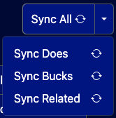
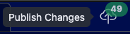
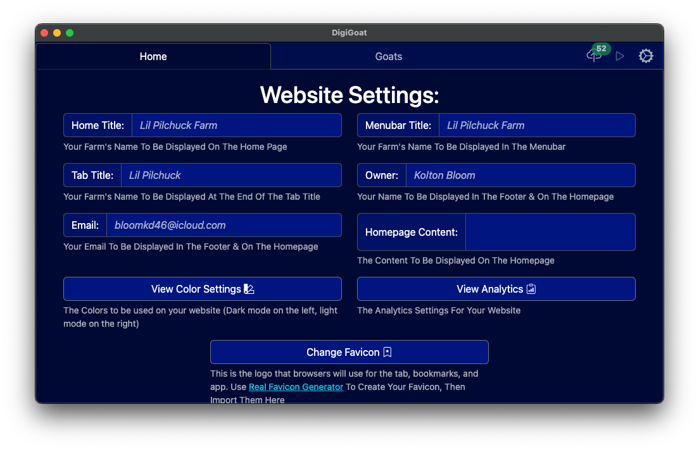

# DigiGoat Client App
## Key Features:
- [Works with ADGA](#works-with-adga)
- [Internet efficient](#internet-efficient)
- [Works offline](#works-offline)
- [Personalized recommendations](#personalized-recommendations)
- [Open source](#open-source)
- [Community driven](#community-driven)
- [Personalized support](#personalized-support)
- [View live preview](#view-live-preview) (Coming Soon!)
- [Live preview works offline](#live-preview-works-offline) (Coming Soon!)

### Works with ADGA
No more copy/paste. What used to be hours of entering goats one by one, having to look up the same information each time, is now just the click of a button. When editing your goats, there is a convenient `Sync All` button that fetches all your owned goats, their registration info (such as name, id, etc.), and all the necessary goats (termed "related goats") to automatically construct a pedigree.

### Internet Efficient
Unlike most website editors that require a constant, high speed connection, DigiGoat only uses internet as needed. Such as syncing with ADGA or when you wish to publish changes.
### Works offline
The biggest downfall of web-based website editors, is just that, they require access to the web. Which means that it is impossible to put in some new pictures of your favorite goats taking Grand Champion earlier in the day until you get home, at which point you likely won't have time. However, with DigiGoat you cn enter in all those images (and coming soon, show placings) right away, so all you have to do when you get home is hit `Publish Changes`.

### Personalized recommendations
There are some things that just aren't worth your time, like if you're goats barn names are all the last word in their name. Well, now that info is all suggested so all you have to do is click the input box, and voila! It's all entered.

The same goes for when you are setting up your website for the first time. Why try to figure out what to put in all the boxes when it can just tell you?

Whe you see the italicized text, just click!
### Open source
Every fragment of this code is fully public for inspection. That way you can rest content that no fishy business is happening in the background
### Community driven
All features will be based off of public request. Have a feature in mind that you want to see come to life? Let me know!
### Personalized support
I'm not some faceless corporation or robot answering machine, I'm a real person who can remember your farm and website setup. No more having to play 20 questions every time you need help with something
### View live preview
One important update for the future will be the ability to preview your site just as it would be seen from the public, without having to publish it first.
### Live preview works offline
Once implemented, the live preview will always be available, without having to have any internet connection!
